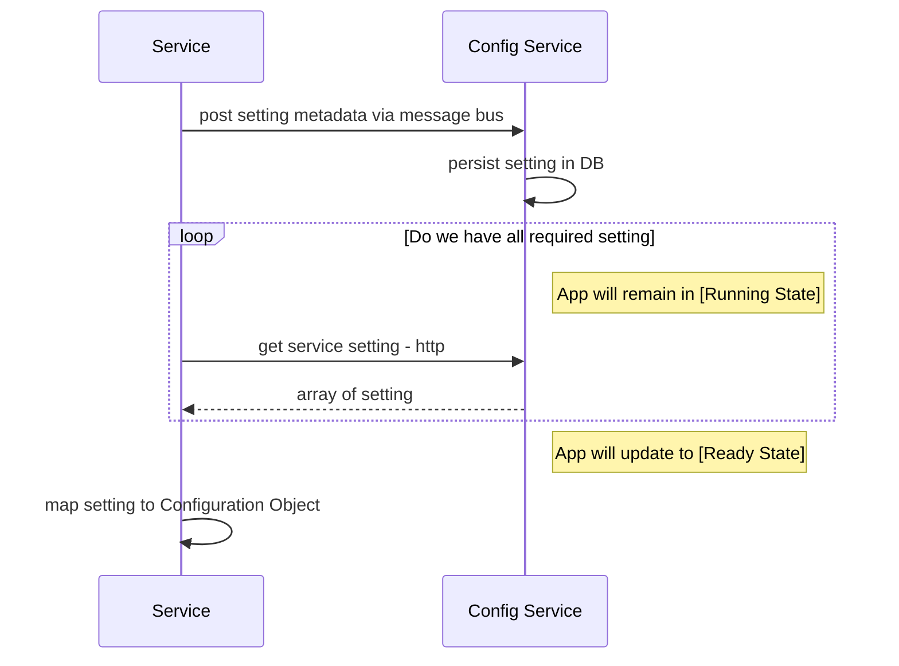

+++
date = '2024-12-14T21:15:59+05:30'
draft = false
title = 'My First Post'
+++

## Introduction

This is **bold** text, and this is *emphasized* text.

Visit the [Hugo](https://gohugo.io) website!

```cs
using System;

namespace HelloWorld
{
  class Program
  {
    static void Main(string[] args)
    {
      Console.WriteLine("Hello World!");
      for (int i = 0; i < 10; i++)
      {
        if (i == 4)
        {
            break;
        }
        Console.WriteLine(i);
      }
    }
  }
}
```
```goat
          .               .                .               .--- 1          .-- 1     / 1
         / \              |                |           .---+            .-+         +
        /   \         .---+---.         .--+--.        |   '--- 2      |   '-- 2   / \ 2
       +     +        |       |        |       |    ---+            ---+          +
      / \   / \     .-+-.   .-+-.     .+.     .+.      |   .--- 3      |   .-- 3   \ / 3
     /   \ /   \    |   |   |   |    |   |   |   |     '---+            '-+         +
     1   2 3   4    1   2   3   4    1   2   3   4         '--- 4          '-- 4     \ 4
```

## Todo

List

- [ ] one
- [ ] two


